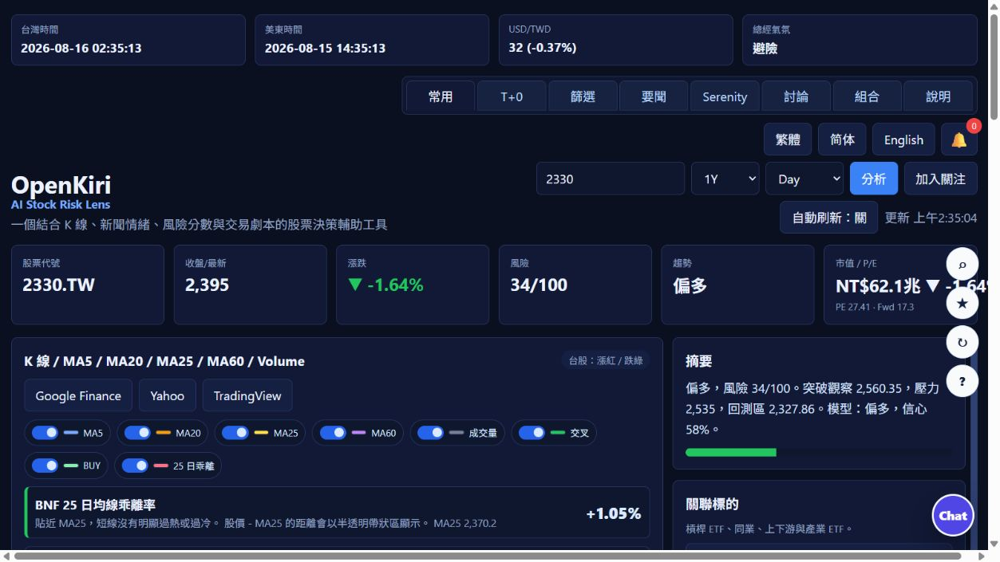
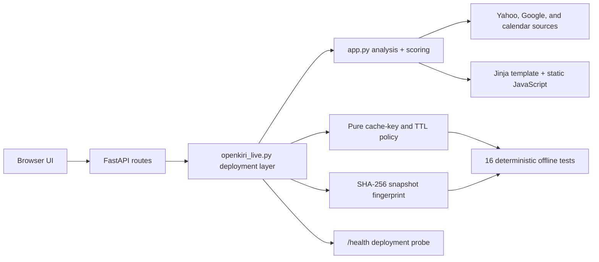

# OpenKiri

OpenKiri is a FastAPI stock-risk dashboard for Taiwan and US stocks. It groups tickers by trend-continuation setups, shows technical risk, and displays floating market-cap and P/E valuation when Yahoo data is available.

Public website:

```text
https://stock-risk-radar.onrender.com/#
```



_The deployed dashboard combines a ticker workflow, technical-risk summary, valuation context, and decision-support levels in one responsive view._

## Features

- Clean single-screen stock dashboard for Taiwan and US symbols such as `2330`, `2330.TW`, `AAPL`, `NVDA`, and `TSLA`.
- Yahoo chart data with MA5, MA20, MA60, RSI, MACD, ATR, volume ratio, and 20-day return.
- Setup filters for golden-cross continuation, golden-cross watch, death-cross continuation, death-cross watch, bullish/bearish MA continuation, volume breakout, MA20 pullback hold, oversold rebound, overheat risk, and mixed consolidation.
- Screener grouping by market, industry, setup type, signal score, low P/E, market cap, risk, change, price, or volume.
- Floating valuation cards for market cap, trailing P/E, and forward P/E from Yahoo quoteSummary, with a static market-cap fallback.
- Deterministic SHA-256 fingerprints for normalized analysis snapshots, exposing whether the result changed after a cache refresh.
- Responsive UI focused on classification and comparison instead of crowded dashboards.

## Architecture



## 60-second interview walkthrough

- **Problem:** combine multiple market-data sources into a responsive analysis UI while limiting latency, rate pressure, and stale intraday results.
- **Decision:** keep shared analysis in `app.py`, isolate deployment behavior in `openkiri_live.py`, and assign upstream-specific TTLs for quote, chart, news, and macro requests.
- **Testability:** cache rules and integrity behavior are covered by 16 deterministic tests, including a mocked `/api/analyze` integration test that never calls external services.
- **Operational evidence:** GitHub Actions compiles the modules, runs unit tests, smoke-imports the deployed FastAPI entry point, and Render exposes `/health`.
- **Trade-off:** public upstream data can be delayed or unavailable, so the app uses explicit fallbacks and presents research-oriented risk context—not investment advice or guaranteed signals.

## Local Run

```bash
python -m venv .venv

# Windows
.venv\Scripts\activate

# macOS / Linux
source .venv/bin/activate

pip install -r requirements.txt
uvicorn openkiri_live:app --reload --host 127.0.0.1 --port 8000
```

Open locally:

```text
http://127.0.0.1:8000
```

## Deploy To Render

Build Command:

```text
pip install -r requirements.txt
```

Start Command:

```text
uvicorn openkiri_live:app --host 0.0.0.0 --port $PORT
```

The included `render.yaml` keeps the existing `stock-risk-radar` Render service name while using the `openkiri_live:app` deployment entry point. `openkiri_live.py` imports shared application and market-analysis logic from `app.py`, then adds production caching and deployment-specific route behavior. Cache policy lives in `openkiri_cache_policy.py`; snapshot canonicalization and SHA-256 change detection live in `openkiri_integrity.py`. Both can be tested without network access.

## Data-integrity experiment

The repository includes a safe local inspector for explaining the difference between a digest's appearance and verified provenance:

```bash
python tools/hash_inspector.py 098f6bcd4621d373cade4e832627b4f6 --demo OpenKiri-Demo
```

A 32-character hexadecimal string is reported only as **MD5-shaped**. That shape is not proof that MD5 produced it. The command computes MD5 and SHA-256 locally from known text so the result is reproducible. OpenKiri itself uses SHA-256—not MD5—to fingerprint a normalized market-data snapshot and returns:

```json
{
  "algorithm": "sha256",
  "fingerprint": "<64 hexadecimal characters>",
  "changed_from_previous": false,
  "canonical_bytes": 1234,
  "purpose": "reproducibility and market-data snapshot change detection"
}
```

This is an integrity and reproducibility aid. It is not encryption, authentication, anti-scraping, or proof that an upstream website uses a particular hash algorithm. See the [interview case study](docs/interview_hash_case.md) for evidence and terminology.

## Engineering Checks

```bash
python -m compileall -q app.py openkiri_live.py openkiri_cache_policy.py openkiri_integrity.py tools/hash_inspector.py
python -m unittest discover -s tests -v
python -c "import openkiri_live; assert openkiri_live.app.title == 'OpenKiri'"
```

GitHub Actions runs the same compile, unit-test, and deployed-entry-point smoke checks for `main`, `codex/**`, and pull requests. The tests are deterministic and do not call Yahoo, Google, or other upstream services.

## API

```text
GET /health
GET /api/screener/options
GET /api/analyze?symbol=AAPL&period=6mo&interval=1d
GET /api/screener?markets=US,TW&industries=Semiconductors,Technology&setup=golden_cross_continuation&sort_by=signal&limit=30
GET /api/recommendations?markets=US,TW&limit=8
```

Supported `period`: `1mo`, `3mo`, `6mo`, `1y`, `2y`, `5y`

Supported `interval`: `1d`, `1wk`

## Disclaimer

This tool is for research and education only. It is not investment advice.

## License

[MIT](LICENSE)
