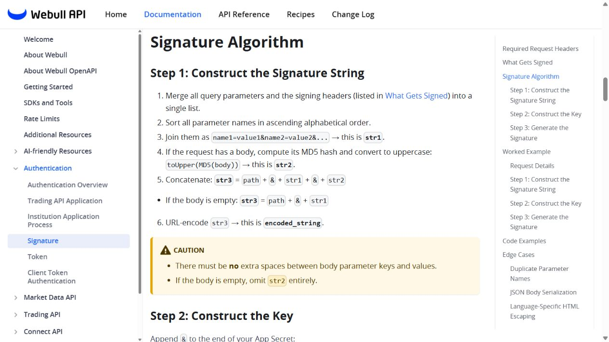
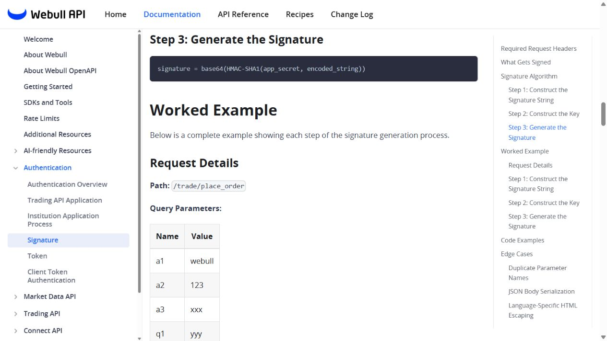
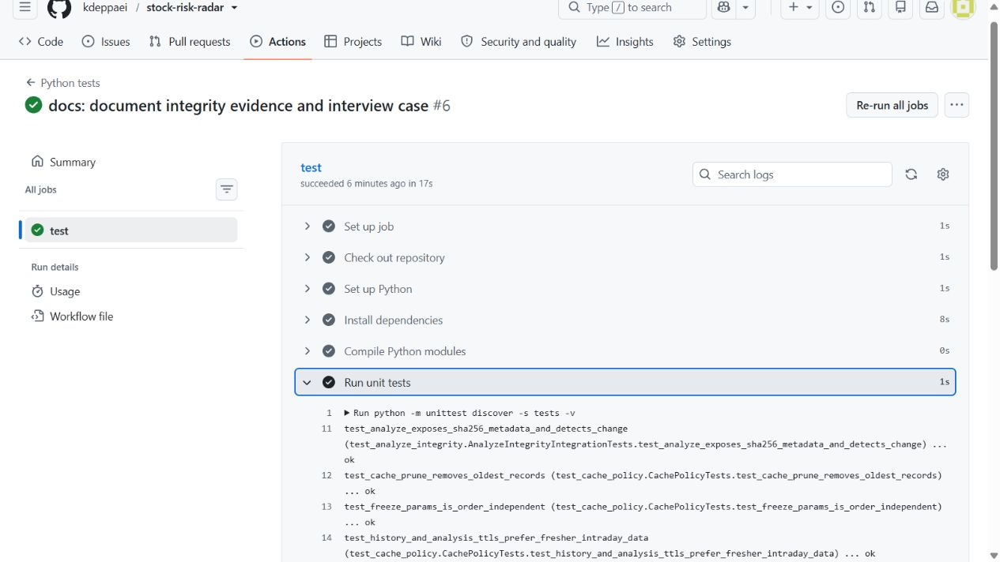
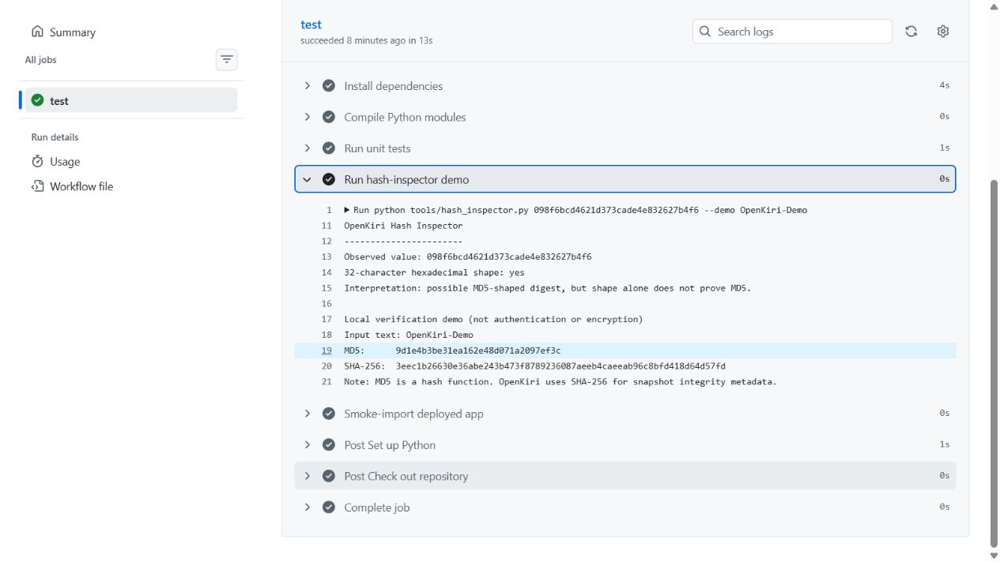

# OpenKiri integrity case study

## Correct technical wording

- MD5 is a **hash function**, not encryption.
- A 32-character hexadecimal value is only consistent with a 128-bit hexadecimal representation; the shape alone does not prove MD5 or reveal the value's purpose.
- MD5 use does not by itself prove an anti-scraping mechanism. A digest may support request signing, integrity checks, authentication compatibility, or deduplication.
- Rate limiting, API keys, sessions, request signatures, CAPTCHA, and WAF controls solve different parts of abuse prevention and access control.

## Official Webull example

Webull's official signature documentation describes the request body MD5 as one component of a larger signing process:

1. Compactly serialize the request body.
2. Compute `toUpper(MD5(body))`.
3. Combine it with the request path, sorted query parameters, and signing headers.
4. URL-encode the combined string.
5. Produce the final signature with `base64(HMAC-SHA1(app_secret, encoded_string))`.

The accurate description is **"MD5 participates in request-body integrity within Webull's API signature construction"**, not "Webull encrypts data with MD5" or "MD5 blocks crawlers."

Source: [Webull API — Signature](https://developer.webull.com/apis/docs/authentication/signature/)

## What OpenKiri actually does

OpenKiri reads public market data through explicit HTTP clients and applies source-specific caching. Yahoo quote-summary access uses a session plus a crumb token; the application does not contain an MD5-based anti-scraping flow.

The added integrity layer:

1. Selects stable fields from the normalized analysis result.
2. Canonically serializes mappings, lists, and finite numeric values.
3. Computes a SHA-256 fingerprint.
4. Compares it with the previous snapshot for the same symbol, period, and interval.
5. Returns the algorithm, fingerprint, byte count, and changed/not-changed state in the API response.

This supports reproducibility and unexpected-change detection without treating a hash as encryption or authentication.

## Reproducible engineering evidence

The branch uses three focused commits for the inspector, API integration, and documentation. GitHub Actions compiles the modules, runs 16 tests, executes the safe hash-inspector demo, and smoke-imports the deployed FastAPI entry point.

## Security boundary

RFC 6151 advises against MD5 where collision resistance is required. SHA-256 is used because the project needs a modern deterministic fingerprint, not because the fingerprint authenticates the upstream source. Authenticity would require a trusted signing key or another authenticated channel.

Sources:

- [RFC 6151 — Updated Security Considerations for MD5](https://www.rfc-editor.org/info/rfc6151/)
- [NIST FIPS 180-4 — Secure Hash Standard](https://csrc.nist.gov/pubs/fips/180-4/upd1/final)
